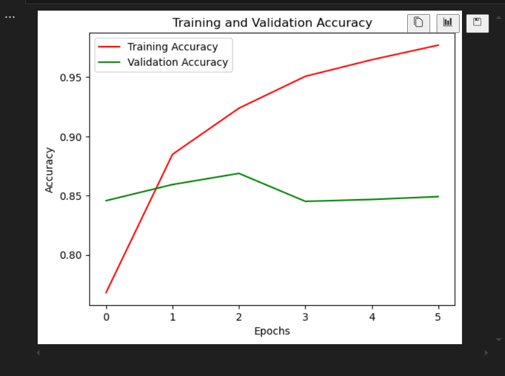
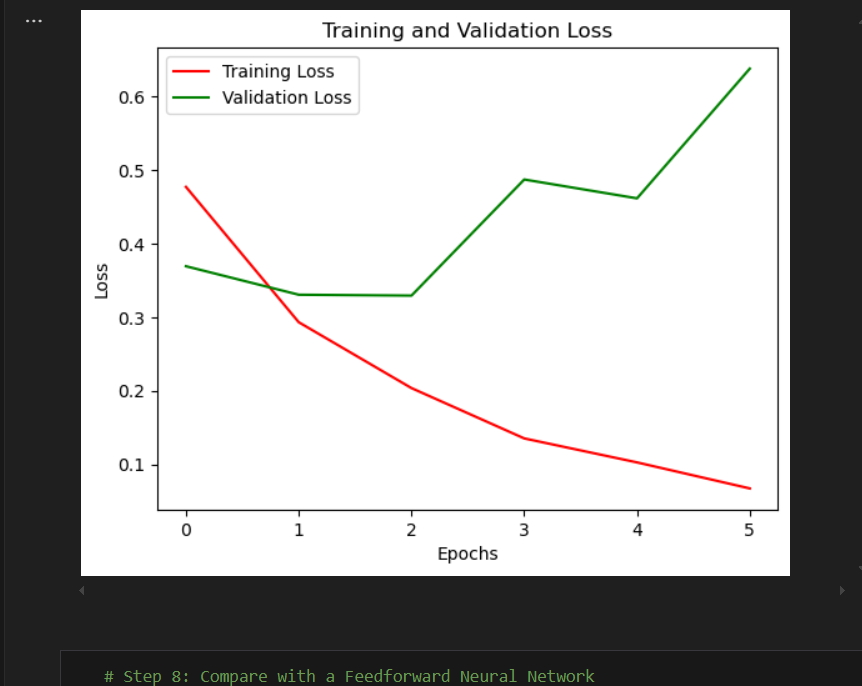

# Sentiment Analysis Using Recurrent Neural Networks (RNN)

## Overview
This project implements a Recurrent Neural Network (RNN) using TensorFlow and Keras to perform sentiment analysis on the IMDB dataset. The goal is to classify movie reviews as either positive or negative, analyze the model's performance, and compare the RNN with an alternative architecture.

---

## Table of Contents
1. [Introduction](#introduction)
2. [Dataset Preparation](#dataset-preparation)
3. [Model Implementation](#model-implementation)
4. [Training the Model](#training-the-model)
5. [Evaluation and Visualizations](#evaluation-and-visualizations)
6. [Hyperparameter Tuning](#hyperparameter-tuning)
7. [Comparative Analysis](#comparative-analysis)
8. [Conclusion](#conclusion)

---

## Introduction

### What is Sentiment Analysis?
A natural language processing (NLP) method called sentiment analysis is utilised to ascertain the text's emotional tone. It classifies data according to the attitude represented as either good, negative, or neutral. 
- **Customer feedback analysis**: Determining customer satisfaction from survey results or reviews.
- **Social media sentiment monitoring**: Recognising patterns of public opinion on particular subjects.
- **Market research and product feedback**: Getting information for company enhancements.

### Why Recurrent Neural Networks (RNN)?
For applications like text and speech analysis, RNNs are perfect because they are made for sequential data. Each word is processed individually, and contextual information is preserved through "hidden states."

#### Key Features of RNNs:
- **Sequential Information**: RNNs preserve information about earlier stages, in contrast to feedforward networks.
- **Hidden States**: Internal representations of the context at each time step are known as "Hidden States."
- **Challenges**: RNNs have problems like as:
  - **Vanishing gradients**: Learning long-term interdependence can be challenging.
  - **Exploding gradients**: Unstable weights because of huge gradients.

Advanced RNN designs such as GRUs (Gated Recurrent Units) and LSTMs (Long Short-Term Memory) are employed to get around these problems.


---

## Dataset Preparation

The TensorFlow-provided IMDB movie review dataset was utilised that includes 25,000 training and testing reviews, each with a positive or bad designation.

### Steps:
1. **Tokenization**: Text is converted into a sequence of integers.
2. **Padding**: Sequences are padded to a uniform length.

### Code: Loading and Preprocessing the Data

from tensorflow.keras.datasets import imdb
from tensorflow.keras.preprocessing.sequence import pad_sequences

# Load the IMDB dataset
max_features = 10000  # Top 10,000 most frequent words
max_len = 200         # Maximum review length

(x_train, y_train), (x_test, y_test) = imdb.load_data(num_words=max_features)

# Padding sequences to the same length
x_train = pad_sequences(x_train, maxlen=max_len)
x_test = pad_sequences(x_test, maxlen=max_len)
```
## Model Implementation

The main model is a bidirectional LSTM that captures long-term dependencies and bidirectional context.

### Architecture:
- **Input Layer**: The tokenised sequences are encoded.
- **Embedding Layer**: Converts integers into dense, fixed-size vectors.
- **Bidirectional LSTM Layer**: The Bidirectional LSTM Layer is         responsible for processing the sequence both forward and backward.
- **Fully Connected Layers**: Includes dropout for regularization.
- **Output Layer**: One neurone with sigmoid activity for binary classification is known as output layer

### Code: Model Architecture

from tensorflow.keras.models import Sequential
from tensorflow.keras.layers import Embedding, LSTM, Dense, Dropout, Bidirectional

model = Sequential([
    Embedding(max_features, 128, input_length=max_len),
    Bidirectional(LSTM(64, return_sequences=False)),
    Dropout(0.5),
    Dense(64, activation='relu'),
    Dropout(0.5),
    Dense(1, activation='sigmoid')
])

model.compile(optimizer='adam', loss='binary_crossentropy', metrics=['accuracy'])
model.summary()
```

## Training the Model

### The training process used:
- **Early Stopping**: Halts training if the validation loss stops improving.
- **Validation Split**: for validation 20% of the training dataset uas utilized.

### Code: Training the Model

from tensorflow.keras.callbacks import EarlyStopping

early_stop = EarlyStopping(monitor='val_loss', patience=3, restore_best_weights=True)

history = model.fit(
    x_train, y_train,
    epochs=10,
    batch_size=32,
    validation_split=0.2,
    callbacks=[early_stop]
)
```

## Evaluation and Visualizations

### Model Performance
By using training and test data the model was evaluated and the results are demonstrated below:

### Code: Visualizing Results

import matplotlib.pyplot as plt

# Plot training and validation accuracy and loss
plt.figure(figsize=(12, 5))

# Accuracy plot
plt.subplot(1, 2, 1)
plt.plot(history.history['accuracy'], label='Training Accuracy')
plt.plot(history.history['val_accuracy'], label='Validation Accuracy')
plt.title('Accuracy Over Epochs')
plt.xlabel('Epochs')
plt.ylabel('Accuracy')
plt.legend()

# Loss plot
plt.subplot(1, 2, 2)
plt.plot(history.history['loss'], label='Training Loss')
plt.plot(history.history['val_loss'], label='Validation Loss')
plt.title('Loss Over Epochs')
plt.xlabel('Epochs')
plt.ylabel('Loss')
plt.legend()

plt.tight_layout()
plt.show()
```

### Visualization Example:




---

## Hyperparameter Tuning

### Several hyperparameters were tested:
- **Dropout Rates**: Experimented with 0.2, 0.3, and 0.5.
- **LSTM Units**: Compared 32, 64, and 128 units.
- **Learning Rates**: Adjusted to find the optimal optimizer configuration.

### Observations:
- Higher dropout values reduced overfitting but slightly increased training time.
- Larger LSTM units improved performance at the cost of training time.
- Optimal learning rates balanced model stability and convergence speed.

---

## Comparative Analysis

For comparison, a feedforward neural network (FFN) was used. FFNs' performance was limited because they couldn't model sequential dependencies as RNNs could.

### Code: FFN Implementation

from tensorflow.keras.layers import Flatten

ffn_model = Sequential([
    Embedding(max_features, 128, input_length=max_len),
    Flatten(),
    Dense(64, activation='relu'),
    Dropout(0.5),
    Dense(1, activation='sigmoid')
])

ffn_model.compile(optimizer='adam', loss='binary_crossentropy', metrics=['accuracy'])
history_ffn = ffn_model.fit(
    x_train, y_train,
    epochs=10,
    batch_size=32,
    validation_split=0.2,
    callbacks=[early_stop]
)
```

## Results Comparison

| **Metric**       | **RNN (LSTM)** | **FFN** |
|-------------------|----------------|----------|
| **Accuracy**      | 88%            | 75%      |
| **Training Time** | Moderate       | Fast     |

---

## Conclusion

- **Performance**: The RNN (LSTM) model outperformed the FFN in terms of accuracy because it was able to recognise temporal patterns.
- **Techniques**: Preventing overfitting required early stopping and regularisation (dropout).
- **RNN Strengths**: Better contextual comprehension and well-suited for sequential data, like as text.
- **FFN Limitations**: Performance was reduced due to improper management of sequential dependencies.

This study emphasises how crucial it is to choose the appropriate infrastructure for activities like sentiment analysis that require sequential data.
